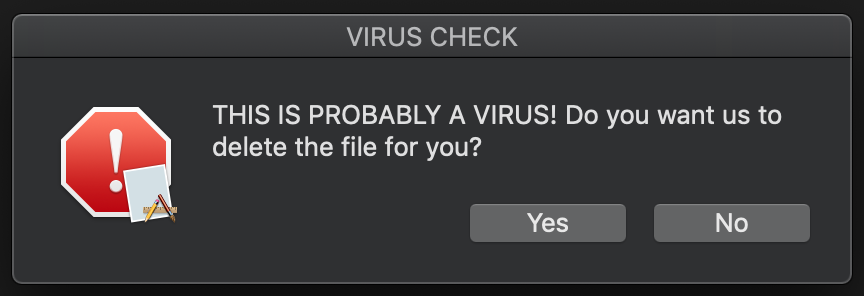
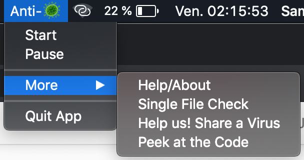

# Open-Source-Anti-Virus

Open Source Anti-Virus MAC OS menu-bar app. A different approach to virus checking - uses a hexadecimal comparison based algorithm. 
We use a big list of know viruses to test whether a file is a virus or not. We also support zip files and directories. This is Open Source because you can contribute by adding malicious files in our separate repository to help improve the app.

If you have a known virus file that you'd like to add to our app, please go here and follow the instructions there:
https://github.com/samueljaval/List-of-viruses-for-Open-Source-Anti-Virus

 - This app only runs on macOS
 - The UI is in the Mac Menu Bar at the top of the screen
 - A standalone app can be made with py2app
 - You can test it by running the scripts using (with python3 or more recent): python main.py   (you need to install the rumps and pync packages with pip) 
 - As it is, the main loop (excluding single file check) only works for downloads from chrome and safari but can be easily modified to cover more browsers (comments in the code can help know what to change)  
 

 
